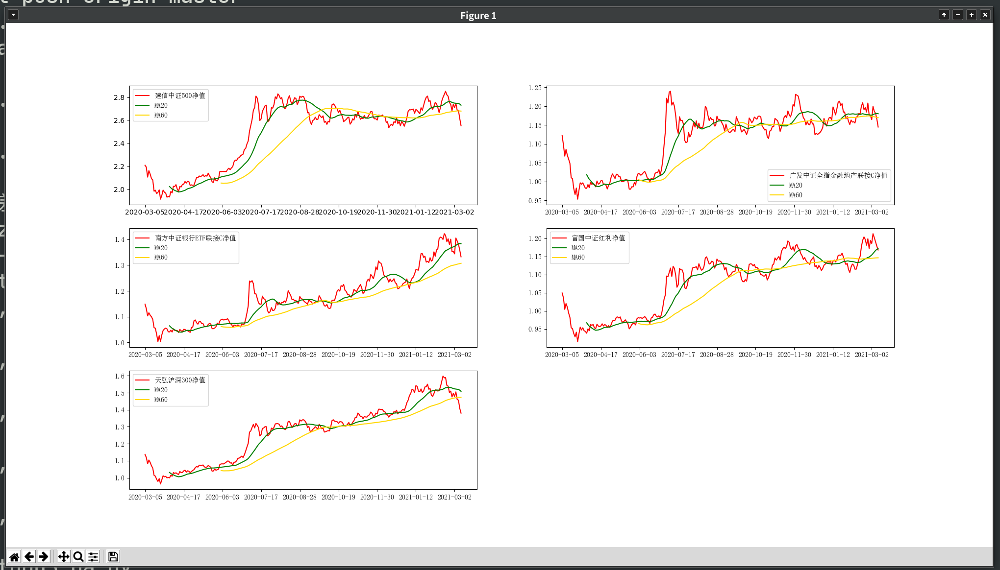
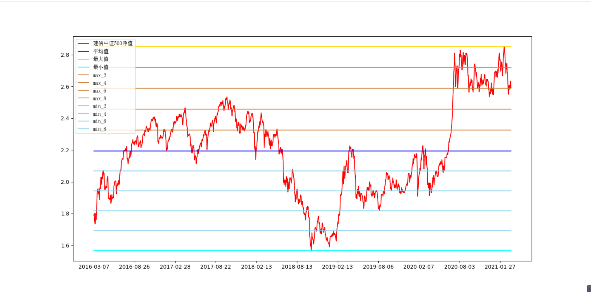
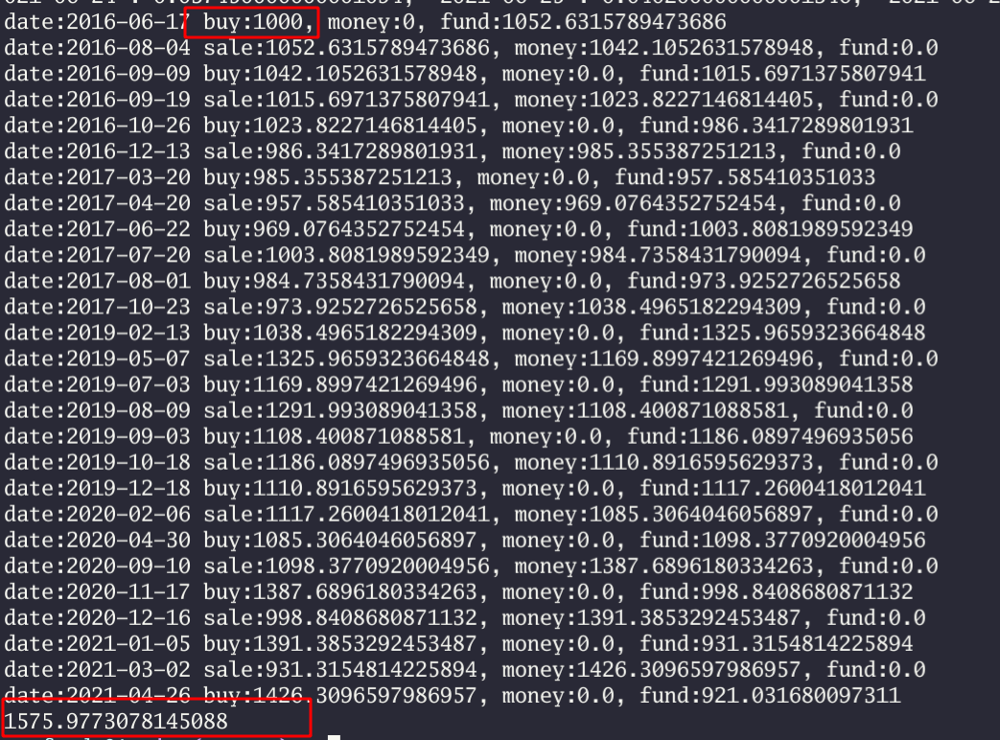

## 简介
这是一个Python的小程序啦。

数据来源是东方财富网，感谢提供API。

使用这个工具，需要有一点python知识。

## 使用方法
### 初始化数据
首先定位到qa.py的下面代码，这些是关注的基金和代码，例如:
```
fund_codes = {
    "000478": "建信中证500",
    "002979": "广发中证全指金融地产联接C",
    "004598": "南方中证银行ETF联接C",
    "100032": "富国中证红利",
    "005918": "天弘沪深300",
}
```
进入控制台，执行：
```
python3 tools.py refresh
```

等待一段时间，同级目录下会生成“db_000478.json”等文件。这是最重要的原始数据。巧妇难为无米之炊，没有这个就没法画图。

首次执行，会进行历史数据的拉取。起始时间定义在tools.py的start_date中。
```
start_date = "2020-03-05"
```

### 刷新数据
如果同级目录下已经存在数据文件，执行：
```
python3 tools.py refresh
```
只会拉取增量数据，不用担心

### 进行定量分析
state_line.StateLine定义了一个抽象类，里面op方法留空。每一个stateLine对象，都是一条曲线。传入原始数据，并经过op方法，就会返回一条曲线的定义。

要实现自己的曲线，需要继承StateLine类，并实现自己的`op`方法。op方法会返回四个参数的列表，代表N条曲线：`[x坐标数组，y坐标数组，颜色，标签]`。

本程序已经实现了valuation_line（净值曲线）, ma_line（均值曲线）, avg_line(平均值，最大值，最小值)。具体参考代码。

当实现了曲线，就可以在画板上进行分析了。具体上，参考qa.py文件。目前实现了在同一个画板画净值曲线，MA20，MA60。在源数据已经就绪的情况下，执行：
```
python3 qa.py # 默认画所有关注基金的ma图
```
将会启动图形界面如下：


还有更多玩法
```
python3 ma 000478 # 只画这一只基金的ma图
python3 avg 000478 # 画这一只基金的历史平均数线，最高线，最低线。并且，将它们均匀分隔成4条估值线。参考E大的估值
```


### DIY
有了这一套框架，就能实现各种各样的曲线进行定量分析啦。万里长征迈出了第一步。

祝大家玩的愉快。


## 回测策略
最近在想，如果我有一个策略。比如如何通过历史数据来验证策略是否赚钱。也就是回测。

假设有这个策略：设ma20曲线的导数为dma20，2阶导为ddma20。假如一阶导数在十天内有7天大于0（上涨），并且二阶导大于0（加速）则买入。如果是买入状态，连续3天一阶导小于0则卖出。
这个策略在strategy.strategy_ma20.py里。

回测我准备了1000元虚拟金。然后用历史数据不停的根据这个策略买卖。最终可以算得它的赢亏。这些逻辑在check_strategy.check_ma20.py里。没考虑手续费。

具体可以执行run_check_strategy.py，如何是502000，最终可以算得它从1000通过不断的买卖变成了1500多。当然这也只是一个例子。还有更多好玩的，要diy。

